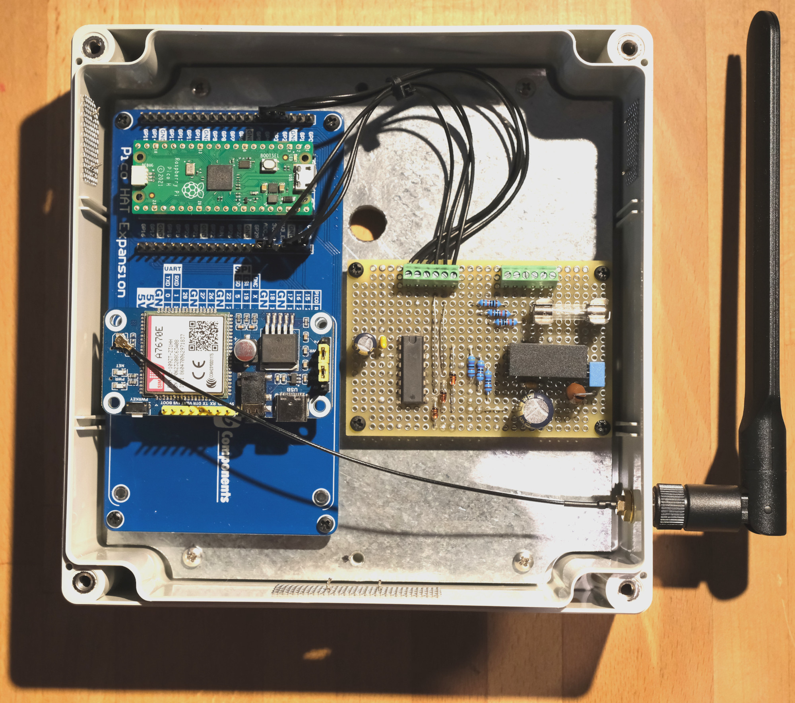

# Overview
AlarmDial is a 4G/LTE-capable alarm dialler. The device sends notifications via text message (SMS) to a mobile phone when the inputs are activated by a connected alarm panel. So when the intruder alarm is activated, for example, the mobile phone receives a text (SMS).

The project came about because PSTN landlines are being phased out in the UK. This makes fixed-line alarm diallers obsolete. I prefer to be informed about alarm events by text since that is fairly immediate and involves no intermediary other than the mobile network operator, unlike app-based solutions.

Alarm diallers using the mobile network are available to purchase, but building one seemed more interesting. I have not done much with embedded controllers but always wanted to. So here was an opportunity to explore embedded computing while building something that is actually useful.

The hardware is based on a Raspberry Pi Pico with a 4G modem HAT, and some simple electronics for power and converting inputs level. The modem is the cheapest 4G-capable model I could find.

**Features:**
* Power supply 9-18V, usually 12V from the alarm panel.
* Power consumption about 0.6W (measured 40-50mA at a 12V supply).
* Three inputs, drawing 1mA at 12V. 0-3V is interpreted as logical “low” and anyting above 7V as “high”. The inputs should be able to handle up to 50V. A possible setup is to connect the inputs to the alarm panel outputs for “intruder alarm”, “alarm set”, and “panic button”.
* The inputs use negative logic, i.e., “low” is interpreted as “activation” by the Pico code. If the panel uses positive logic, the notification messages can be changed accordingly.
* Remote configuration via text (SMS) to the device. The remote configuration is password protected. The configuration is saved to the Pico’s flash memory and survives a power cycle.
* The device sends a network status message every four weeks. This keeps the SIM “alive” as network operators disconnect SIMs they deem inactive.
* In case of network connectivity loss, the Pico and the modem reboot.
* In case the Pico hangs, the Pico and the modem reboot.
* When everything works well, the Pico’s LED flashes every second.
* Incoming voice calls are always rejected.
* Incoming SMS without the correct password are ignored.
* The device takes about 40 seconds to boot.
* The cost of the components is £125, including an unnecessarily fancy case that costs £37.

# Remote commands

Configuration commands are sent to the device as text messages (SMS) from a mobile phone. All commands are case sensitive and need to start with the current password. The default password is `674358`, and that should be changed. It’s best to change the telephone number first, and the password second.

The following list explains all implemented remote commands.
 
**Set telephone number.** This sets the telephone number the device sends SMS messages to. This will be the number of the user’s own smartphone.

Command format: `XXXXXX TelephoneNumber!NNNN…N`

Usage: `XXXXXX` is the current password (default `674358`). The default number is `+447700900000`. The new telephone number (`NNNN…N`) needs to be formatted as required by the network operator who provided the SIM for the alarm dialler. Do not use spaces. The software contains code to check the number format and reject obviously invalid numbers, but that verification is commented out by default because the format depends on the country.

**Change password.** The password needs to be exactly six characters long. It can contain any character. The password can be reset to the default value at the device by connecting `GP5` of the Pico to `GND` for longer than 1 second.

Command format: `XXXXXX Password!YYYYYY`

Usage: `XXXXXX` is the current password (default: `674358`) and `YYYYYY` is the new password.

**Report signal strength.** The signal strength is reported on a scale of 0-31, with 0 worst and 31 best.

Command format: `XXXXXX Signal?`

Usage: `XXXXXX` is the current password.

**Set action rules.** This configures whether a specific input triggers SMS notifications or not. For example, if one input is connected to the alarm panel “set” output, then an SMS is sent every time the alarm system is armed. Such messages can be disabled with this command.

Command format: `XXXXXX SMSonInput!N`

Usage: `XXXXXX` is the current password. `N` is the input (1-3) for which the current SMS action is toggled. By default, all inputs trigger an SMS notification.

**Set SMS notification text.** This configures the text of the notification received via SMS for a triggered input.

Command format: `XXXXXX MessageText!N!<On,Off>!MSG_TEXT`

Usage: `XXXXXX` is the current password. `N` is the input (1-3) for which the notification text is changed. `On` specifies that `MSG_TEXT` is the new notification for the input activating (i.e., the voltage on the input is pulled “low”). `Off` specifies that `MSG_TEXT` is the new notification for the input deactivating (i.e., the voltage on the input is pulled “high”). The default notification texts are listed under “Set defaults”. `MSG_TEXT` is limited to 49 characters, excess characters are discarded.

**Set defaults.** This resets all settings to the default values. The default values are as follows
* Password: `674358`
* Telephone number: `+447700900000` (a UK dummy number as set aside by Ofcom)
* SMS action: All inputs trigger SMS notifications
* SMS notification text for input 1 On: `Intruder alarm triggered`
* SMS notification text for input 1 Off: `Intruder alarm cleared`
* SMS notification text for input 2 On: `Alarm system armed`
* SMS notification text for input 2 Off: `Alarm system disarmed`
* SMS notification text for input 3 On: `Panic button pressed`
* SMS notification text for input 3 Off: `Panic button cleared`

Command format: `XXXXXX Defaults!` 

Usage: `XXXXXX` is the current password.

# How to build it

The basic steps to get this device up and running are
* Prepare the modem by connecting it to a PC and configuring it as described below.
* Adapt and compile the software, and install on a Raspberry Pi Pico.
* Adapt the circuit to your requirements, and build the electronics.
* Insert a pay-as-you-go SIM into the modem.
* Install the components inside an adequate case.
* Connect the device to your alarm panel.
* Configure the device via SMS. Set the mobile number first, and then change the password.

## Prepare modem

The code assumes that the modem has been permanently configured to communicate on the serial port at 9600 Baud. This is easiest done by connecting the bare modem (not connected to the Pico) to a PC with a USB cable, then setting up a minicom session, and entering the configuration command through minicom.

The steps for this modem preparation under Linux are
* Install minicom with `apt-get install minicom`
* Connect the modem to the PC with a USB cable.
* Check the output of `dmesg` for the device that the modem is connecting as (e.g., `/dev/ttyUSB0` or `/dev/ttyACM0`).
* Invoke `minicom -s` in a shell, choose the modem’s USB device (from `dmesg`), then “exit” into a session
* Disconnect the modem
* Reconnect the modem
* The minicom session should then show the modem boot messages. If it does not, look online for help.
* Once the modem is “talking” through minicom, enter the following command: `AT+IPREX=9600`

This sets the modem serial interface speed permanently to 9600 Baud. There are several reasons why this speed makes sense. It is not possible to leave the modem’s serial interface at its default speed (115200 Baud) and instead change the serial speed in the Pico’s source code to 115200 Baud. That will not work without more extensive changes to the code.

Next, the modem needs to jumpered to enable power cycling by the Raspberry Pico. The jumper connecting `PWR` to `3V3` (the factory setting) needs to be changed to connect `PWR` to `P4`.

## Adapt and compile software

The source code is written in C. First adapt the program as required, particularly:
* Set the default telephone number to something sensible in the country of operation. Source code line 298.
* Set the time interval beween sending network status message (by default, four weeks). Source code line 50. Note this is in microseconds.
* Implement some sense checks on new telephone numbers. The current checks for UK mobile numbers are commented out because they would prevent setting a perfectly acceptable German mobile number, for example. Code lines 723-724 and 731-738.

None of these changes are strictly necessary. The code should work without any changes.

Compiling the code requires the Pico SDK to be installed.
* Create a new project directory
* Copy `pico_sdk_import.cmake` from the SDK `external` directory into the project directory, as well as `AlarmDial.c` and `CMakeLists.txt` from the GitHub repository
* Adjust line 10 in `CMakeLists.txt` to the directory of the SDK
* Create a subdirectory `build` in the project directory
* Change into `build`
* Run `cmake ..`
* Run `make`

The code should compile without warnings. Connect the Pico to the PC holding the programming button, and copy `AlarmDial.uf2` to the Pico. All these steps follow the usual routine for Pico programming. Please look up one of the many guides available online for help.

Instead of adapting and compiling the source source code in this way, it is also possible to just copy `AlarmDial.uf2` from the GitHub repository to the Pico.

## Adapt and build electronics

The circuit has two main functions, power supply and input level conversion. The power supply takes the input supply (e.g., the auxiliary power output from alarm panel) and converts that to a stable 5V supply for the Pico and the modem. This is done using a switching type DC-DC converter. A linear converter would produce too much heat inside the enclosure. The TMR 3-1211 is probably overspecified since it is an isolated design which is not necessary.

The inductor and capacitor at the input of the converter form an EMC filter, following the application notes for the TMR 3-1211. The application notes advise that the filter components should be placed as close to the converter as possible.

The Pico runs at 3.3V and converts the 5V supply accordingly. This 3.3V from the Pico is used for the input level conversion, so it is fed from the Pico’s 3V3(OUT) pin back into the circuit.

The 12V signals from the alarm panel need to be converted to the Pico’s 3.3V levels. The CD74HC4050 outputs “true” 3.3V logic as it is supplied with 3.3V. The inputs are quite tolerant, accepting up to 16V without damage. In principle, this would allow connecting the alarm panel outputs directly to the CD74HC4050 inputs. The circuit adds a level of safety with 2:1 voltage dividers (so the alarm panel’s “high” at 13V is turned to 4V), which are protected with 12V Z-diodes. This way, pretty much anything short of a disastrously high voltage can be applied to the inputs without damaging the circuit (60V would still keep all components within specifications). 

**Assembly:** See the bill of materials. The choice of the passive components does not seem particularly critical.

Once the circuit is built and tested, plug the programmed Raspberry Pi Pico into the “Pico HAT Expansion” board (PHE from here on). Plug the configured modem, with the SIM inserted, into the PHE board.

Next, install the circuit board and the PHE board inside the enclosure. The circuit consumes about 0.6W, not much but this is inside a sealed plastic enclosure. I drilled three vent holes and covered them with wire mesh to hold off insects.

Next, connect the circuit board to the Pico.
* Circuit `GND` to PHE `GND`
* Circuit `+5V` to PHE `VBUS` (do not use `VSYS`, since that wouldn’t power the modem)
* Circuit `3.3V` to PHE `3V3_O`
* Circuit `Out1` to PHE `GP2`
* Circuti `Out2` to PHE `GP3`
* Circuit `Out3` to PHE `GP4`

Finally, connect the circuit board to the alarm pannel
* Circuit `GND` to panel ground
* Circuit `+12V` to panel auxiliary power output
* Circuit `Inp1` to panel “intruder alarm” signal
* Circuit `Inp2` to panel “set” signal
* Circuit `Inp3` to panel “panic button” signal

The device takes at least 40 seconds to boot. This is due to a coded time delay allowing the modem to register with the network. After about 40 seconds, the Pico LED should be flashing once every second. If not, check the fuse first.

### Bill of materials
As of May 2024, the total cost is about £125 in the UK. The case with the panel alone costs £37 and the DC-DC converter another £21. Both can probably be replaced by cheaper alternatives.

| Item | Model | Count |
| :--- | :--- | ---:|
| Case | Hammond 1555RGY | 1 |
| Case panel | Hammond 1554RPL | 1 |
| Pico expansion board | SB Components Pico HAT Expansion | 1 |
| Prototyping board | Vector Electronics 8029 | 1 |
| 6-way terminal block | MULTICOMP PRO MP008516 | 2 |
| Fuse holder | SCHURTER 0751.0052 | 2 |
| Fuse 500mA F | ESKA 520.614 | 1 |
| Film capacitor 0.68uF/63V | EPCOS B32529C0684J189 | 1 |
| Ceramic capacitor 100nF/50V | AVX SR205C104KAR | 2 |
| Electrolytic capacitor 100uF/50V | Panasonic EEUFC1H101 | 1 |
| Electrolytic capacitor 47uF/50V | Panasonic EEUFC1H470 | 1 |
| Inductor 10uH/2.45A | EPCOS B82144B2103K000 | 1 |
| Resistor 10kOhm/0.25W | Yageo MFR-25FRF52-10K | 3 |
| Resistor 4.7kOhm/0.25W | Yageo MFR-25FRF52-4K7 | 3 |
| Z-Diode 12V/500mW | MULTICOMP PRO 1N5242B | 3 |
| DC-DC converter | Traco TMR 3-1211 | 1 |
| Level conversion IC | CD74HC4050 | 1 |
| Raspberry Pi Pico | With headers | 1 |
| Modem | Waveshare A7670E LTE Cat-1 HAT | 1 |
| Misc. assembly items | Wiring, screws, PCB standoffs, wire mesh | |
